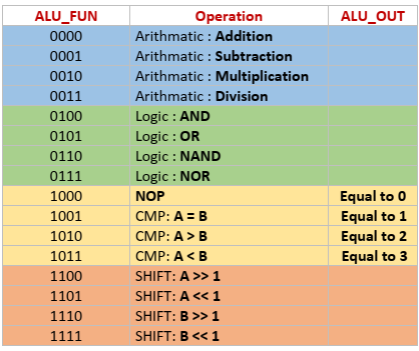

# UART_Digital_Communication_System

## Introduction
This project is an implementation of a Low Power Configurable Multi Clock Digital System that uses Universal Asynchronous Receiver-Transmitter (UART) in Verilog. 
It is responsible of receiving commands through UART receiver to do different system functions as register file reading/writing or doing some processing using ALU block and send result using 4 bytes frame through UART transmitter communication protocol.

## Block Diagram

## System Specifications
- Reference clock (REF_CLK) is 50 MHz
- UART clock (UART_CLK) is 9.6 KHz
- Div_ratio is 8
- Clock Divider is always on (clock divider enable = 1)

## Sequence of Operation
- Initially configuration operations are performed through Register file write operations in addresses (0x2, 0x3).
- The Master (Testbench) start to send different commands (RegFile Operations, ALU operations)
- System will receive the command frames through UART_RX, it sent to the SYS_CTRL block to be processed 
- Once the operation of the command is performed using ALU/RegFile, SYS_CTRL sends the result to the master through UART_TX 
- Register File Address Range for normal write/read operations (From 0x4 to 0x15)
-    Register File Addresses reserved for configurations and ALU operands (From 0x0 to 0x3)

## Supported Commands
1. Register File Write command (3 frames)
`RF_Wr_Data RF_Wr_Addr RF_Wr_CMD(0xAA)`
2. Register File Read command (2 frames)
`RF_Rd_Addr RF_Rd_CMD(0xBB)`
3. ALU Operation command with operand (4 frames)
`Operand_A  Operand_B  ALU_FUN ALU_OPER_W_OP_CMD(0xCC)`
4. ALU Operation command with No operand (2 frames)
`ALU_FUN ALU_OPER_W_NOP_CMD(0xDD)`
### ALU Operations

## Backend
### RTL Synthesis
I uploaded TCL script to automate Synposys Design Compiler and constrains file to check setup/hold violations
### Formal Verification
TCL script to automate Synposys Formality to verify functional equivalance between RTL and netlist, 
It must be run after Synthesis, DFT, and PnR
### Design For Testability
TCL script to insert dft and DRCs and test coverage

