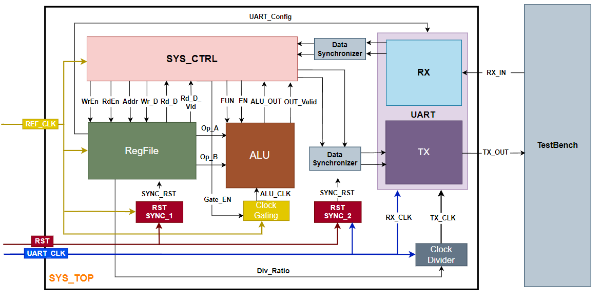

#    UART_Digital_Communication_System

## Introduction
This project is an implementation of a Low Power Configurable Multi Clock Digital System that uses Universal Asynchronous Receiver-Transmitter (UART) in Verilog. 
It is responsible of receiving commands through UART receiver to do different system functions as register file reading/writing or doing some processing using ALU block and send result using 4 bytes frame through UART transmitter communication protocol.

## Block Diagram

